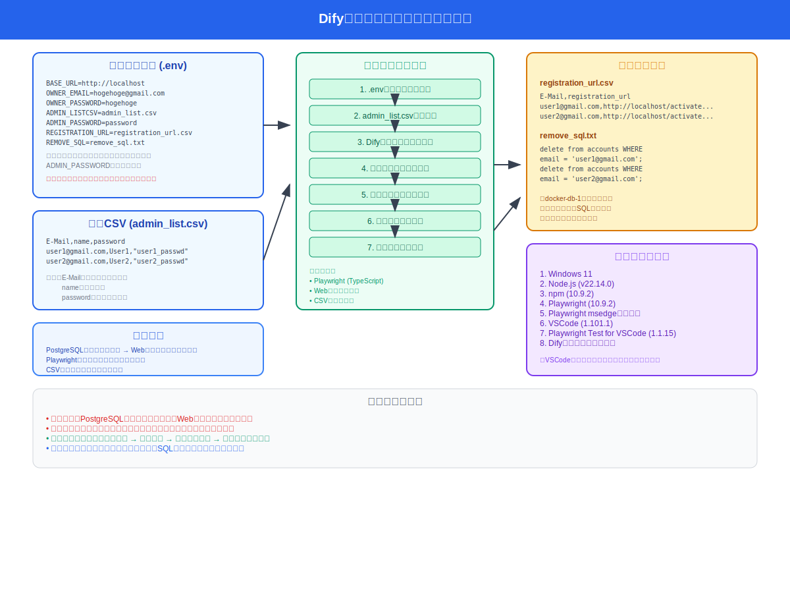

# Dify管理者追加の自動化

このプロジェクトは、PlaywrightのE2Eテスト自動化フレームワークを使用して、Difyシステムへの管理者アカウントを自動的に追加するためのツールです。
admin_list.csvに記載された管理者のリストをDifyの管理者として登録することができます。



## 主な機能

- Difyシステムへの管理者アカウントの自動追加
- CSVファイルによる管理者情報の一括管理
- 詳細なテストレポートの生成
- Difyのユーザ招待時のURLのバックアップ
- DifyのPostgreSQL用のユーザ強制削除SQLの生成

## 必要条件

- Node.js (16.x以上)
- npm (8.x以上)
- Difyシステムへの管理者アクセス権限

## セットアップ手順

1. リポジトリのクローン:
```bash
git clone [repository-url]
cd dify-admin-automator
```

2. 依存関係のインストール:
```bash
npm install
```

3. Playwright依存パッケージのインストール:
```bash
npx playwright install --with-deps
```

4. Playwrightブラウザのインストール:
```bash
npx playwright install msedge
```

5. 設定ファイルの準備:
```bash
cp .env.example .env
cp admin_list.csv.example admin_list.csv
```

## 設定ファイル

### 1. 環境変数 (.env)

`.env.example`をコピーして`.env`を作成し、以下の項目を設定します：

```ini
BASE_URL=http://localhost          # DifyサーバーのベースURL
OWNER_EMAIL=hogehoge@gmail.com    # Dify所有者のメールアドレス
OWNER_PASSWORD=hogehoge           # Dify所有者のパスワード
ADMIN_LISTCSV=admin_list.csv     # 管理者リストのCSVファイル名
ADMIN_PASSWORD=password          # 管理者アカウントのデフォルトパスワード
REGISTRATION_URL=registration_url.csv  # 登録URLの保存先ファイル名
REMOVE_SQL=remove_sql.txt       # ユーザー削除用SQLファイル名
```

### 2. 管理者リスト (admin_list.csv)
ツールを実行すると管理者アカウント情報を以下のフォーマットで記載します：

| 列名 | 説明 | 例 |
|------|------|-----|
| E-Mail | 管理者のメールアドレス | user1@gmail.com |
| name | 管理者の表示名 | User1 |
| password | 管理者のパスワード | "user1_passwd" |

```csv
E-Mail,name,password
user1@gmail.com,User1,"user1_passwd"
user2@gmail.com,User2,"user2_passwd"
```

### 3. 生成ファイル

#### registration_url.csv
ツールを実行すると管理者アカウント登録時に生成される登録用URLが保存されます：
```csv
E-Mail,registration_url
user1@gmail.com,http://localhost/activate?email=user1%40gmail.com&token=xxxxx
```

#### remove_sql.txt
管理者アカウント削除用のSQLコマンドが生成されます：
```sql
delete from accounts WHERE email = 'user1@gmail.com';
```

## ソースコードの修正
「AddAdmin2Dify.spec.ts」の「既存の管理者アカウントでサインイン」59行目付近に以下のコードがあるが、
これは、所有者を作成するときにアカウント名を「Dify」としたときに動作するコードのため、アカウント名によって
ソースコードを修正する必要がある。
例えば「Automator Dify」というアカウント名にした場合は'A'という文字のボタン名に変更する必要がある。

```
await page.getByRole('button', { name: 'D', exact: true }).click();
```

## テストの実行

### 基本的な実行方法

```bash
# すべてのテストを実行
npx playwright test

# 特定のテストファイルを実行
npx playwright test tests/AddAdmin2Dify.spec.ts

# UIモードでテストを実行
npx playwright test --ui
```

### テストレポート

テスト実行後、`playwright-report`ディレクトリにHTMLレポートが生成されます：
```bash
npx playwright show-report
```

## プロジェクト構造

```
Playdify-admin-automatorwright
├── tests/                      # テストファイル
│   ├── AddAdmin2Dify.spec.ts  # 管理者追加スクリプト
│   └── example.spec.ts        # サンプルテスト
├── playwright.config.ts        # Playwright設定
├── .env.example               # 環境変数テンプレート
├── .env                       # （注意）.env.exampleファイルをコピーして環境に合わせて編集してください。
├── admin_list.csv.example     # 管理者アカウントリストのテンプレート
├── admin_list.csv            # 管理者アカウントリスト
├── registration_url.csv      # 登録用URL保存ファイル（ツール実行時に生成されます）
├── remove_sql.txt            # ユーザ削除用SQLファイル（ツール実行時に生成されます）
└── package.json              # プロジェクト依存関係
```

## 管理者アカウントの削除

⚠️ **重要な注意事項**
- Difyの管理画面ではユーザーの無効化のみサポート
- データを登録していないユーザーのみ削除可能
- 削除はデータの整合性に影響を与える可能性があるため要注意

### PostgreSQLでの削除手順

1. PostgreSQLコンテナにアクセス:
```bash
docker exec -it docker-db-1 bash
```

2. データベースに接続:
```bash
psql -U postgres -d dify
```

3. ユーザー情報の確認と削除:
```sql
-- ユーザー情報の確認
select * from accounts;

-- 特定ユーザーの削除
delete from accounts WHERE email = 'example@gmail.com';